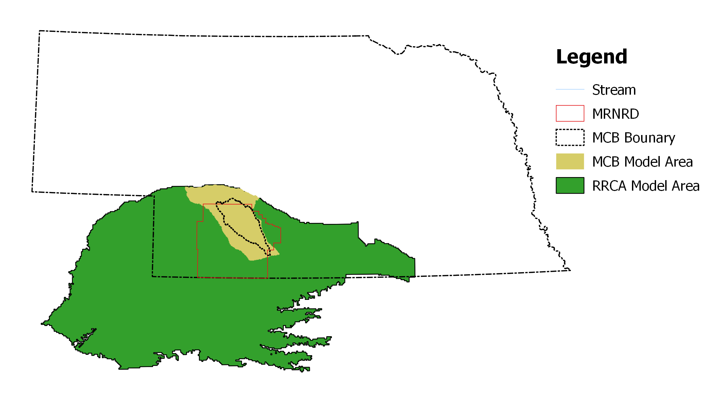
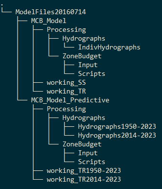

```{r setup, include=FALSE}
knitr::opts_chunk$set(echo = TRUE)
```


## 1. Introduction
This report provides a peer review of the numerical groundwater model for the Medicine Creek Basin (MCB), situated in southeastern Nebraska. The model is developed developed by Brown and Caldwell (BC) for Middle Republican Natural Resources District (MRNRD) to simulate long-term groundwater behavior within the Basin based on historical changes in agricultural land use and associated changes in groundwater pumping. The Medicine Creek is a tributary of the Repblican River, rising in the High Plains of eastern Colorado and flowing through Nebraska and Kansas. the waters of the Republican River between the states is allocated by the Republican River Compact Administration (RRCA) using the Repblican River Basin model (referred to as the RRCA model). As shown in Figure 1, the modeling area of the MCB model is located inside the RRCA model.  Therefore, it is important to compare the performances of these two models especially for assessment of stream-aquifer hydrologic connection.



## 2. Scope and Purpose
The objective of this review is to compare the MCB and RRCA model results and evaluate the applicability of the MCB model for assessing the degree of stream-aquifer hydrologic connection. Specfically, the review includes:

1. compare model settings
2. compare model results including groundwater levels and water budgets
3. compare results of stream-depletion simulation

The observed groundwater levels are provided by DNR.
<!--The MCB model report and files used in this review are listed below: -->
The model files on which this review is based are included in a compressed file `MCB_ModelFiles_ModelsOnly20160714.7z` that contains the following directory structure:
<!---->
```
└── ModelFiles20160714
    ├── MCB_Model
    │   ├── Model_Build_Tools
    │   ├── Processing
    │   │   ├── Hydrographs
    │   │   │   └── IndivHydrographs
    │   │   └── ZoneBudget
    │   │       ├── Input
    │   │       ├── Original
    │   │       ├── Output
    │   │       └── Scripts
    │   ├── working_SS
    │   └── working_TR
    └── MCB_Model_Predictive
        ├── Model_Build_Tools
        ├── Processing
        │   ├── Hydrographs
        │   │   ├── Hydrographs1950-2023
        │   │   └── Hydrographs2014-2023
        │   └── ZoneBudget
        │       ├── Input
        │       ├── Output
        │       └── Scripts
        ├── working_TR1950-2023
        └── working_TR2014-2023
```
Two model documents are also received with the model files, :

> Brown and Caldwell, 2016, Medicine Creek Basin Groundwater Model Development and Calibration

> Brown and Caldwell, 2016, Medicine Creek Basin Model User's Guide

The RRCA model files are retrived from the RRCA website (http://www.republicanrivercompact.org/) on Sep 30, 2016.

## 3. Model Settings
Both models are developed using the MODFLOW code. However, compared with the RRCA model, some newer MODFLOW packages are used in the MCB model (Table 1). In MCB, the Upstream-Weighting (UPW) Package is an alternative to the LPF Packages used in the RRCA model for calculating all terms in the discretized groundwater-flow equation. the UPW Package smoothes the horizontal-conductance function and the storage-change function during wetting and drying of a cell to provide continuous derivatives for solution by the NWT solver. The Newton (NWT) solver used in the MCB model is intended for solving problems involving drying and rewetting nonlinearities of the unconfined groundwater-flow equation. The RRCA model is a single layer model without dewatering grid cells and therefore the PCG solver is used. 

External aquifer hydraulic stresses simulated in the modes include groudnwater pumping, recharge and ET. The desired groundwater pumping rate, maximum ET as well as the groundwater recharge are calculated beforehand using different methods. In this area, groundwater recharge consists of four components: precipitation, groundwater return flows, surface water return flows and canal seepage. A number of precipitation-recharge curves are used by RRCA to estimate the recharge from precpitation based on the soil and land use types. Groundwater return flows are calculated as a fraction of groundwater pumping. Surface water return flows are calculated as a fraction of surface water deliveries. Both of these return flows are are added to the precipitation recharge in the month that the pumping or deliveries occur. Canal leakage is calculated based on records kept by the canal owners. Canal leakage is added to the recharge array in the month that the leakage occurs. On the other hand, the CropSim model is adopted in the MCB model to calculates a time-series of ET, deep percolation, irrigation requirement, and runoff. The canal seepage recharge of the RRCA model is duplicated in the MCB model.

For boundary conditions, both models include Stream-Routing (STR, SFR) packages, Genral Head Boundary (GHB) package, Drain (DRN) package. In the MCB model, the Harry Strunk Reservoir is simulated using the Reservoir (RES) package while it is represented as fixed-stage stream segments in the RRCA STR package. For stream depletion calculation, the reservoir seepage is considered as part of the stream-aquifer interaction. In MCB, the entire lengths of the Platte and Republican rivers were simulated with the RIV package.

*Table 1. Model Components and the MODFLOW Packages*

| **Components**          	| **RRCA** 	| **MCB**  	|
|-------------------------	|---------	|---------	|
| GW Flow                 	| LPF     	| UPW     	|
| Solver                  	| PCG     	| NWT     	|
| GW Pumping              	| WEL     	| MNW     	|
| GW Recharge             	| RCH     	| RCH     	|
| GW ET                   	| EVT     	| EVT     	|
| Reservoir             	  | STR     	| RES     	|
| Stream                  	| STR     	| SFR2    	|
| River                   	| -       	| RIV     	|
| Drain                   	| DRN     	| DRN     	|
| Head-dependent Boundary 	| GHB     	| GHB     	|

Table 2 shows the time and space discreitizations of the two models. 

*Table 2 Time and Space Discritization*


## Model Settings

The maximum ET surface is set to be the ground surface and the extinction depth is set to 10 feet. 5 feet for MCB 

map of hydrualic conductivity

## Model Water Budget

## Performance of Simulating Observed Groundwater Levels

The performance of simulating observed groundwater levels are estimated using three statisticics: mean absolute error, coefficient of determination and nash coefficient. 
$R^2$

indicates that the model explains all the variability of the response data around its mean.


$$ R^2 = \frac{( H_i - H_o )}{( H_i - H_o )} $$

$$ N

1. more accurate inputs
2. more accurate model

You can also embed plots, for example:

```{r pressure, echo=FALSE}
a = 1
plot(pressure)
print(a)
```

Note that the `echo = FALSE` parameter is added to the code chunk to prevent printing of the R code that generated the plot.


## Performance of Stream Depletion Simulation


## Conlusion