```{r setup, include=FALSE}
knitr::opts_chunk$set(echo = TRUE)
```


## 1. Introduction
This report provides a peer review of the numerical groundwater model for the Medicine Creek Basin (MCB), situated in southeastern Nebraska. The model is developed developed by Brown and Caldwell (BC) for Middle Republican Natural Resources District (MRNRD) to simulate long-term groundwater behavior within the Basin based on historical changes in agricultural land use and associated changes in groundwater pumping. The Medicine Creek is a tributary of the Repblican River, rising in the High Plains of eastern Colorado and flowing through Nebraska and Kansas. the waters of the Republican River between the states is allocated by the Republican River Compact Administration (RRCA) using the Repblican River Basin model (referred to as the RRCA model). As shown in Figure 1, the modeling area of the MCB model is located inside the RRCA model.  Therefore, it is important to compare the performances of these two models especially for assessment of stream-aquifer hydrologic connection.


## 2. Scope and Purpose
The objective of this review is to compare the MCB and RRCA model results and evaluate the applicability of the MCB model for assessing the degree of stream-aquifer hydrologic connection. Specfically, the review includes:

1. compare model settings
2. compare model results including groundwater levels and water budgets
3. compare results of stream-depletion simulation

The observed groundwater levels are provided by DNR. <!--The BC data is not used because they only use one level each year Doesn't show the seasonal change due to pumping.  -->
<!--The MCB model report and files used in this review are listed below: -->
The model files on which this review is based are included in a compressed file `MCB_ModelFiles_ModelsOnly20160714.7z` that contains the following directory structure:
<!---->
```
└── ModelFiles20160714
    ├── MCB_Model
    │   ├── Model_Build_Tools
    │   ├── Processing
    │   │   ├── Hydrographs
    │   │   │   └── IndivHydrographs
    │   │   └── ZoneBudget
    │   │       ├── Input
    │   │       ├── Original
    │   │       ├── Output
    │   │       └── Scripts
    │   ├── working_SS
    │   └── working_TR
    └── MCB_Model_Predictive
        ├── Model_Build_Tools
        ├── Processing
        │   ├── Hydrographs
        │   │   ├── Hydrographs1950-2023
        │   │   └── Hydrographs2014-2023
        │   └── ZoneBudget
        │       ├── Input
        │       ├── Output
        │       └── Scripts
        ├── working_TR1950-2023
        └── working_TR2014-2023
```
Two model documents are also received with the model files:

> Brown and Caldwell, 2016, Medicine Creek Basin Groundwater Model Development and Calibration

> Brown and Caldwell, 2016, Medicine Creek Basin Model User's Guide

The RRCA model files are retrived from the RRCA website (http://www.republicanrivercompact.org/) on Sep 30, 2016.

## 3. Model Settings
Both models are developed using the MODFLOW code. However, compared with the RRCA model, some newer MODFLOW packages are used in the MCB model (Table 1). In MCB, the Upstream-Weighting (UPW) Package is an alternative to the LPF Packages used in the RRCA model for calculating all terms in the discretized groundwater-flow equation. the UPW Package smoothes the horizontal-conductance function and the storage-change function during wetting and drying of a cell to provide continuous derivatives for solution by the NWT solver. The Newton (NWT) solver used in the MCB model is intended for solving problems involving drying and rewetting nonlinearities of the unconfined groundwater-flow equation. The RRCA model is a single layer model without dewatering grid cells and therefore the PCG solver is used. 

External aquifer hydraulic stresses simulated in the modes include groudnwater pumping, recharge and ET. The desired groundwater pumping rate, maximum ET as well as the groundwater recharge are calculated beforehand using different methods. In this area, groundwater recharge consists of four components: precipitation, groundwater return flows, surface water return flows and canal seepage. A number of precipitation-recharge curves are used by RRCA to estimate the recharge from precpitation based on the soil and land use types. Groundwater return flows are calculated as a fraction of groundwater pumping. Surface water return flows are calculated as a fraction of surface water deliveries. Both of these return flows are are added to the precipitation recharge in the month that the pumping or deliveries occur. Canal leakage is calculated based on records kept by the canal owners. Canal leakage is added to the recharge array in the month that the leakage occurs. On the other hand, the CropSim model is adopted in the MCB model to calculates a time-series of ET, deep percolation, irrigation requirement, and runoff. The canal seepage recharge of the RRCA model is duplicated in the MCB model. For groundwater ET, both models set maximum ET surface to be the ground surface but the extinction depth is set to 10 feet in RRCA while it is 5 feet in MCB.

For boundary conditions, both models include Stream-Routing (STR, SFR) packages, Genral Head Boundary (GHB) package, Drain (DRN) package. In the MCB model, the Harry Strunk Reservoir is simulated using the Reservoir (RES) package while it is represented as fixed-stage stream segments in the RRCA STR package. For stream depletion calculation, the reservoir seepage change is considered as part of the stream-aquifer interaction. In MCB, the Platte and Republican rivers were simulated with the RIV package.

*Table 1. Model Components and the MODFLOW Packages*

| **Components**          	| **RRCA** 	| **MCB**  	|
|-------------------------	|---------	|---------	|
| GW Flow                 	| LPF     	| UPW     	|
| Solver                  	| PCG     	| NWT     	|
| GW Pumping              	| WEL     	| MNW     	|
| GW Recharge             	| RCH     	| RCH     	|
| GW ET                   	| EVT     	| EVT     	|
| Reservoir             	  | STR     	| RES     	|
| Stream                  	| STR     	| SFR2    	|
| River                   	| -       	| RIV     	|
| Drain                   	| DRN     	| DRN     	|
| Head-dependent Boundary 	| GHB     	| GHB     	|

Table 2 shows the time and space discreitizations of the two models. Both models adopted monthly stress periods with two time steps in each stress period. RRCA is a single layer model while the MCB is composed of two convertible layers. The model domain of RRCA is larger than the MCB model and accordingly the resolutions of their grids are 1 mile by 1 mile and 0.25 mile by 0.25 mile, respectively. As a results, the MCB model requires more computational time due to more detailed components and the finer gird. 

*Table 2 Time and Space Discritization*

| **Property**         | **RRCA**            | **MCB**              |
|--------------------- |---------------------|----------------------|
| NLAY,NROW,NCOL,NPER  | 1, 165, 326, ~      | 2, 259, 326, 768     |
| Stress Period (SP)   | monthly             | monthly              |
| Time Step (TS)       | 2 TS per SP         | 2 TS per SP          |
| Grid Resolution      | 1 mile              | 0.25 mile            |
| Layer Type           | 1 convertible layer | 2 convertible layers |
| Simulation Period    | 1918 - Present      | 1950 - 2013          |

## 4. Model Results
### 4.1 Simulated Groundwater Levels
DNR has provided the data of 51 groundwater monitoring wells (Figure 2). All the data are used to compared to the simulated results except for Well BC-2 because this well and Well BC-3 are located in the same grid cell of the RRCA model. Therefore, 50 wells are used to benchmark the performance of these two models. The hydrographs comparing the observation and simulation are added in the Appendix 1.

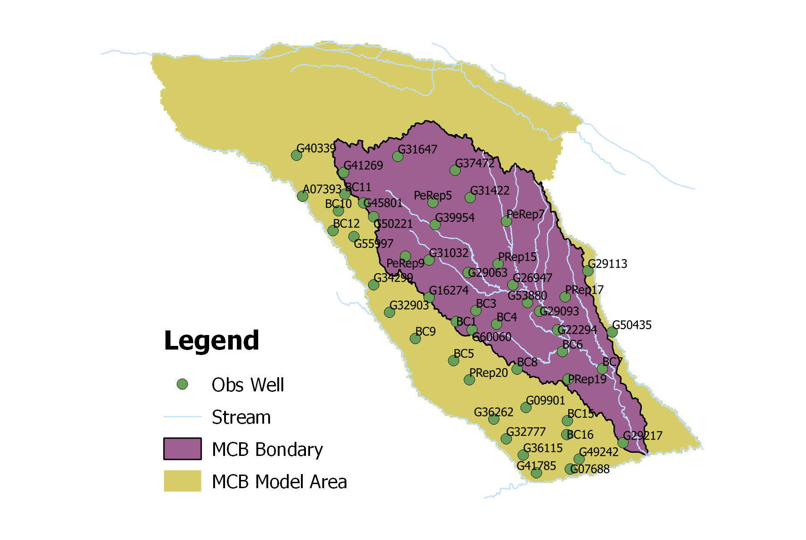

The performance of simulating observed groundwater levels are evaluated using two statisticics: mean absolute error (MAE) and coefficient of determination ($R^2$). The mean absolute error (MAE) is a quantity used to measure how close the simulated groundwater levels are to the observations. On the other hand, the coefficient of determination ($R^2$) indicates how much the model predicts the variability of the observaed groundwater levels. The values of this two statisticics are listed in Table 3 for each monitoring wells. Interestingly, the MCB model performs better based on MAE while the opposite for $R^2$. Nearly always, the reponses in the MCB model are too dull. Most seasonal change and decadal trends are not represented properly in the MCB model. The RRCA model is better than the MCB model on simulating the variability in observed groundwater levels. This can also be confirmed from the hydragraph plots. It may be attributed to several reasons: 1. more accurate stress inputs, such as recharge, pumping and ET, are used in the RRCA model; 2. the RRCA model is better in simulating the responses to stresses.

*Table 3 Model performance on groudnwater level simulation*

|         |       | **MAE**   |       | **R^2^**|      |
|---------|:-------:|:-------:|:-------:|:------:|:------:|
| **Well ID**    | **Count** | **MCB**   | **RRCA**  | **MCB**  | **RRCA** |
|---------|-----|---------|---------|---------|---------|
| A07393  | 36    | 8.56  | 53.44 | 0.79 | 0.93 |
| BC1     | 57    | 5.70  | 11.04 | 0.45 | 0.45 |
| BC10    | 71    | 4.67  | 51.47 | 0.35 | 0.39 |
| BC11    | 75    | 4.20  | 50.70 | 0.42 | 0.55 |
| BC12    | 59    | 23.27 | 30.14 | 0.71 | 0.63 |
| BC15    | 75    | 17.42 | 26.82 | 0.88 | 0.91 |
| BC16    | 72    | 29.88 | 35.62 | 0.97 | 0.96 |
| BC3     | 47    | 4.28  | 21.50 | 0.01 | 0.12 |
| BC4     | 56    | 16.65 | 4.18  | 0.62 | 0.00 |
| BC5     | 57    | 16.85 | 8.13  | 0.36 | 0.06 |
| BC6     | 70    | 8.81  | 25.38 | 0.06 | 0.07 |
| BC7     | 51    | 5.43  | 15.41 | 0.31 | 0.05 |
| BC8     | 66    | 12.01 | 2.76  | 0.90 | 0.93 |
| BC9     | 72    | 17.74 | 17.32 | 0.38 | 0.52 |
| G07688  | 29    | 1.92  | 3.33  | 0.07 | 0.63 |
| G09901  | 80    | 13.72 | 5.08  | 0.94 | 0.94 |
| G16274  | 73    | 2.55  | 24.86 | 0.92 | 0.66 |
| G22294  | 80    | 5.28  | 9.65  | 0.06 | 0.67 |
| G26947  | 80    | 3.03  | 13.46 | 0.06 | 0.48 |
| G29063  | 78    | 5.91  | 11.78 | 0.27 | 0.36 |
| G29093  | 71    | 14.45 | 9.73  | 0.52 | 0.00 |
| G29113  | 80    | 19.13 | 8.04  | 0.03 | 0.00 |
| G29217  | 80    | 17.96 | 21.82 | 0.00 | 0.03 |
| G31032  | 80    | 25.72 | 17.16 | 0.69 | 0.69 |
| G31422  | 58    | 22.20 | 30.16 | 0.32 | 0.16 |
| G31647  | 73    | 8.37  | 90.11 | 0.24 | 0.17 |
| G32777  | 80    | 3.40  | 2.75  | 0.66 | 0.38 |
| G32903  | 73    | 7.71  | 22.18 | 0.89 | 0.80 |
| G34299  | 80    | 15.55 | 43.81 | 0.49 | 0.44 |
| G36115  | 80    | 12.53 | 14.83 | 0.00 | 0.01 |
| G36262  | 80    | 19.27 | 2.14  | 0.54 | 0.21 |
| G37472  | 73    | 6.09  | 40.32 | 0.33 | 0.20 |
| G39954  | 57    | 50.22 | 45.92 | 0.01 | 0.23 |
| G40339  | 74    | 6.64  | 57.54 | 0.68 | 0.71 |
| G41269  | 73    | 7.82  | 62.62 | 0.44 | 0.58 |
| G41785  | 75    | 8.46  | 8.53  | 0.06 | 0.10 |
| G45801  | 66    | 3.58  | 61.56 | 0.51 | 0.56 |
| G49242  | 75    | 3.45  | 18.86 | 0.29 | 0.69 |
| G50221  | 66    | 5.77  | 48.93 | 0.45 | 0.55 |
| G50435  | 61    | 5.24  | 4.65  | NA   | 0.54 |
| G53880  | 37    | 2.62  | 12.54 | 0.30 | 0.42 |
| G55997  | 59    | 20.75 | 42.08 | 0.50 | 0.57 |
| G60060  | 31    | 8.03  | 2.38  | 0.37 | 0.28 |
| PeRep5  | 72    | 3.41  | 31.38 | 0.21 | 0.26 |
| PeRep7  | 72    | 17.13 | 6.88  | 0.03 | 0.51 |
| PeRep9  | 72    | 4.49  | 28.75 | 0.52 | 0.40 |
| PRep15  | 72    | 16.34 | 11.04 | 0.11 | 0.46 |
| PRep17  | 72    | 2.26  | 5.34  | 0.26 | 0.67 |
| PRep19  | 72    | 4.44  | 34.94 | 0.15 | 0.19 |
| PRep20  | 72    | 10.76 | 20.72 | 0.33 | 0.39 |
| Average | 67.4  | 11.23 | 24.60 | 0.40 | 0.43 |

### 4.2 Model Water Budget
The monthly net flow rates are shown in Figure 3. The baseflows in the RRCA model vary significantly more rapily than the MCB model. This could be attribute to the larger groundwater ET in the RRCA model. The pumping rates of these two models are similar. In the MCB model, there are some spiky values in the recharge rates in 1952 and 1957, leading to two rapid changes in the aquifer storage.

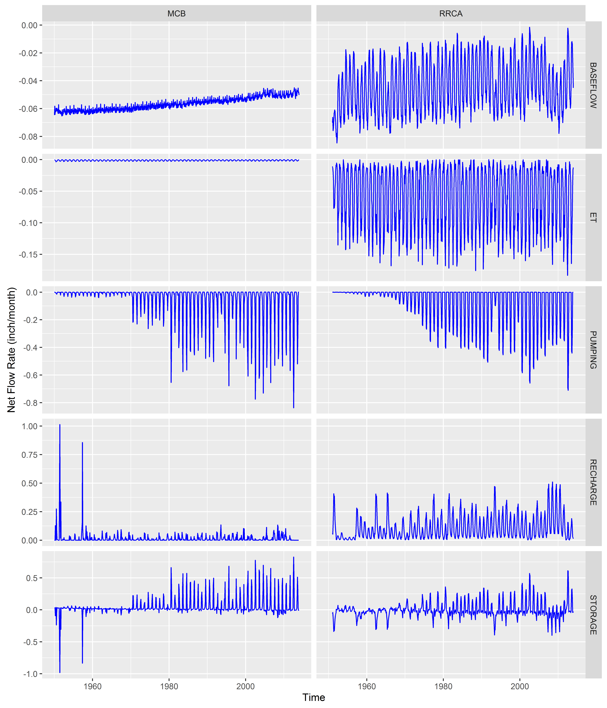

As shown in Figure 4 and 5, two models surprisingly predict the contradictory trends in the aquifer storage changes. Note that MODFLOW output storage is the inverse of the aquifer change. Therefore in the MCB model, the aquifer storage has been steadily reducing, which may be caused by that recharge is significantly smaller than the sum of pumping and baseflow. 

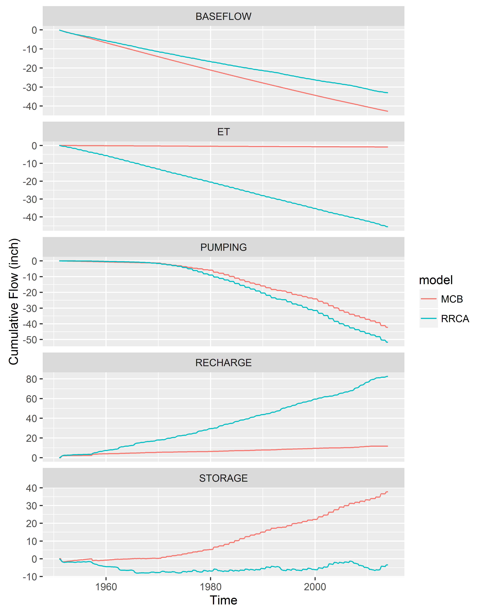


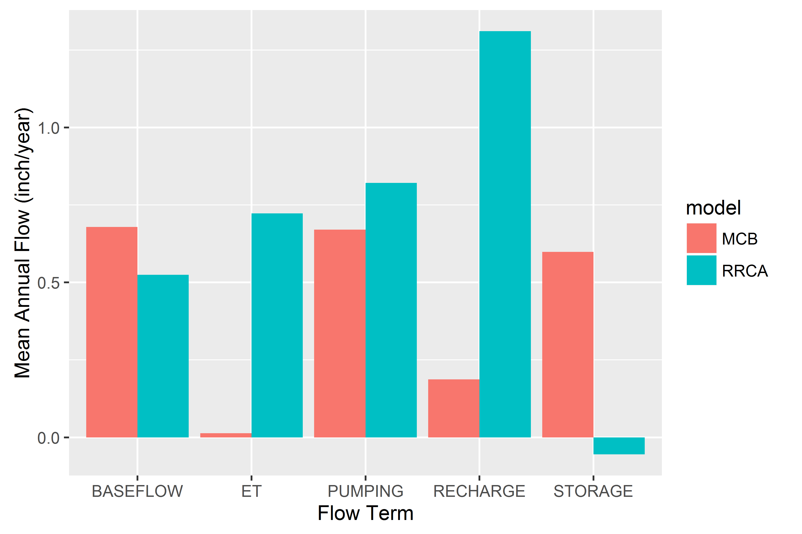

## 5. Performance of Stream Depletion Simulation

Five locations are randomly selected for stream depletion tests (Figure 6). In each test, a new pumping well is added at the location to both models with a constant pumping rate of 0.2 ft^3^/s. The responses at different locations are shown in Figure 7 to 11. For each plot, the upper subplot include the flow change to compesating the addtional pumping added to the system. The water sources for new pumping are mainly groundwater storage and stream leakage. For the locations near the boundary, lateral flow from other zones is also an important source. Overall, the RRCA model has higher stream depletion factors compared to the MCB model. Because the ET in the RRCA baseline model is relatively large, it also impacts the response by having more reduced ET. 

Note that at Location 5, the pumping rate of the new pumping well is reduced by the NWT solver in the MCB model to prevent the cell becoming dry. As a result, the groundater storage becomes the single source for pumping. At Location 3, the response of stream leakage reduces at the end of the modeling period in the MCB model. This may be caused by a disconnected or dry stream segment. It requires further investigation. 

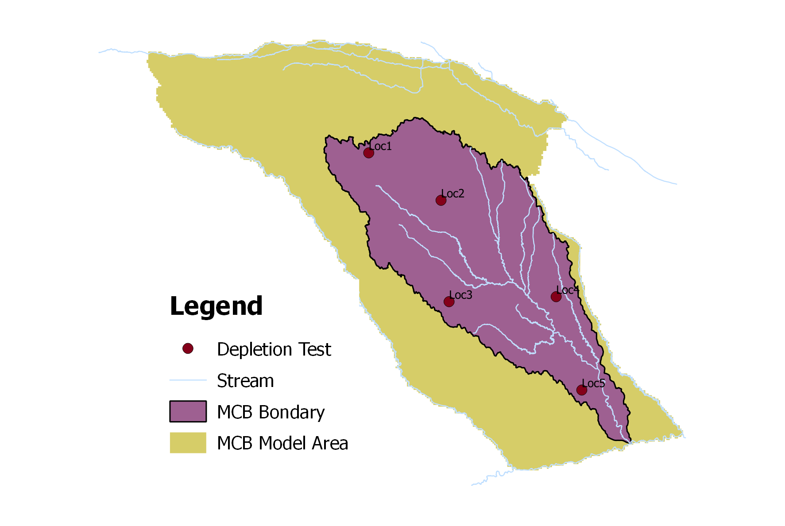

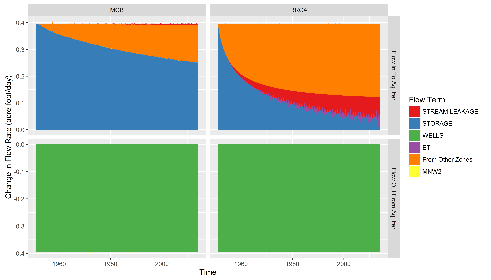

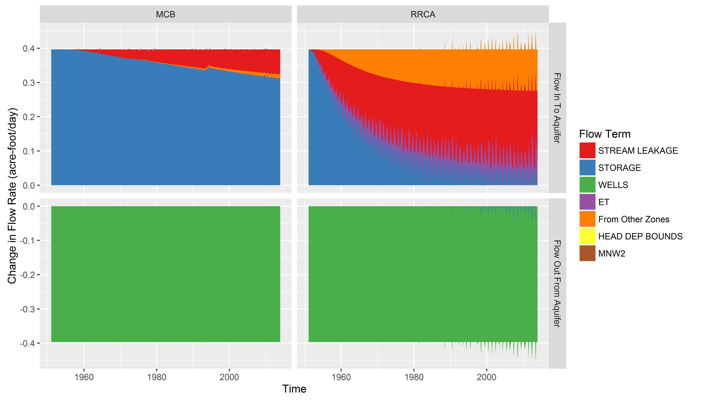

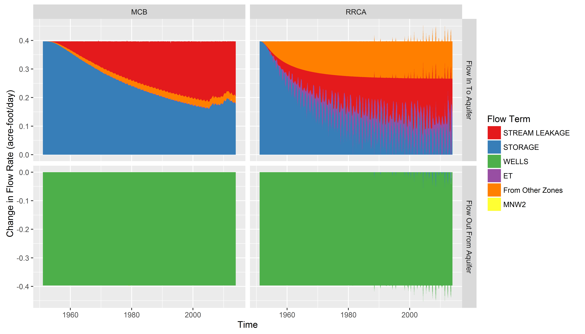

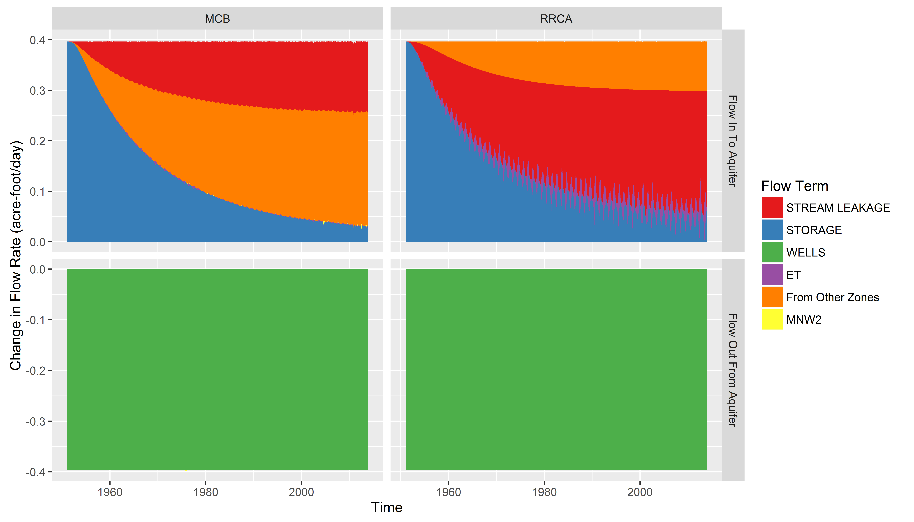

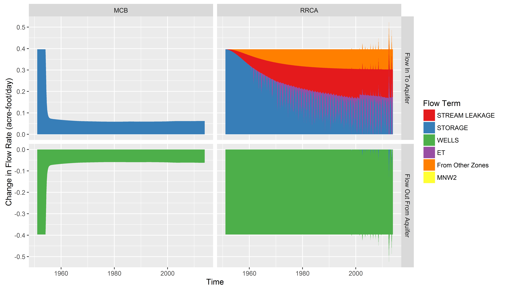

Figure 12 shows the cumulative flow change percentages based on the pumping rate of the new well. For stream leakage, it is the value of the stream depletion factor (SDF). 

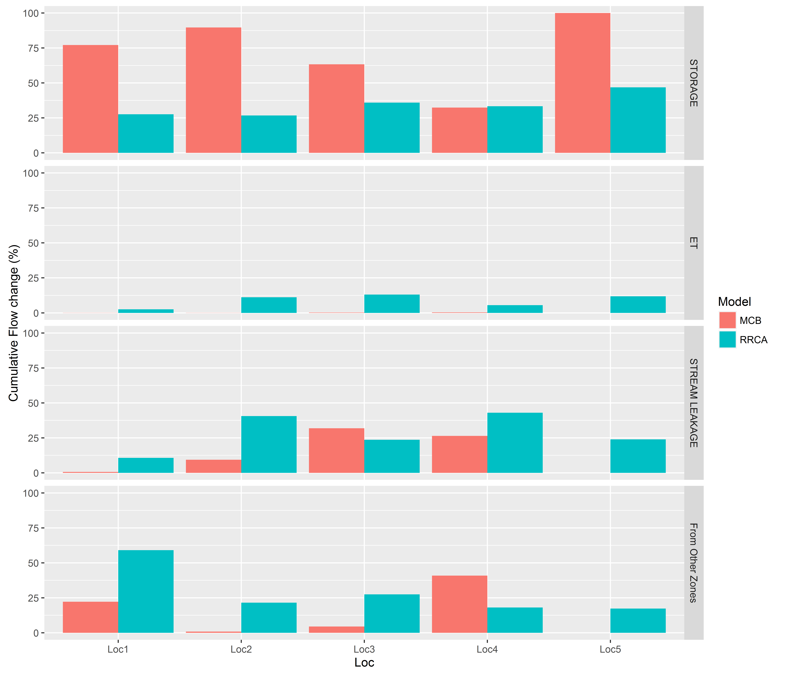

## 6. Conclusion
Overall, the MCB model is well constrcuted. However, there are several issues in the model:

1. the relatively flattened groundwater level hydrograph which could indicate the model lacks capability of reproducing the correct responses to hydraulic stresses;
2. the spiky recharge rates at the beginning of the simulation;
3. relative small groundwater ET and recharge compared to the RRCA model;
4. overall smaller SDF compared to the RRCA model;
5. the NWT solver reducing pumping rate of the new well can affect the result of 10/50 analysis such as discontinuing the SDF distribution.

For future work, the reviewer also recommend to perform the SDF calculation at every cell in the model to test the impact of the NWT solver.


## Appendix 1. Hydrograph of Groundwater Levels
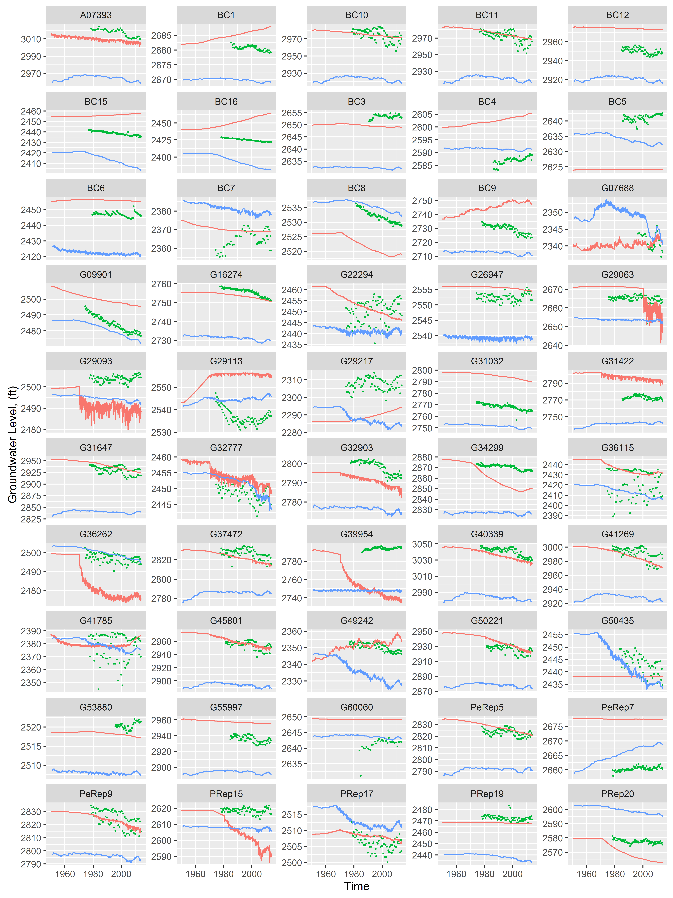